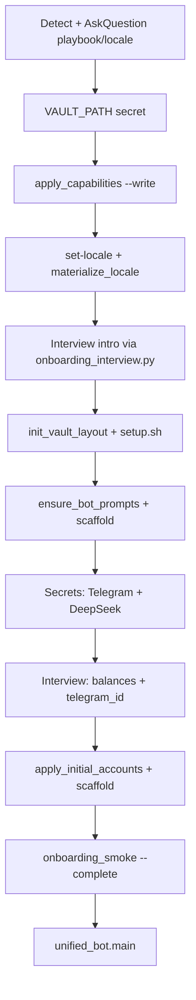

# obsidian-agent onboarding (guided)

You are the **onboarding operator**. The user cloned git and has mostly `*.example` stubs — turn this into a **working, non-leaking** install.

**Entry points:** user runs **`/setup`** in Cursor (`.cursor/commands/setup.md`) or asks to install/onboard. Same playbook either way.

You run shell/Python steps yourself. **Secrets are a live conversation** — one key at a time (see Phase 6). Never dump all tokens in one message at the end.

## Non‑negotiable rules

| Rule | Why |
|------|-----|
| Repo root = directory with `unified_bot/`, `scripts/setup.sh`, `config/agent/` | |
| **Never** commit `.env`, `capabilities.yaml`, `badge.yaml`, prod `**/prompts/*.txt`, `user_profile.md` | Secrets + personal tone |
| **Author full install**: if `config/agent/capabilities.yaml` is **absent**, do **not** create it (absent = all modules/connectors on) | Preserves maintainer machine |
| **New clone**: always `--write` capabilities profile for the chosen modules | Explicit contract |
| **Never overwrite** existing prod `*.txt` or `user_profile.md` unless user explicitly asks | `ensure_bot_prompts.sh` only copies missing |
| `.env`: append placeholders via `--patch-env` / `env_tools.py append-hints`; secrets via `env_tools.py set` only | Never replace non-empty values without `--force` |
| Use **AskQuestion** for modules/connectors; **do not mention** declined options in UI/prompts/sync | Capability contract |
| After each shell step: show **exit code + stderr**; stop on failure unless user wants to skip | |
| **`init_vault_layout.py` only after** `capabilities.yaml` exists **and** locale/`vault_paths` materialized | Prevents planning/KB ghost folders |
| **Never** `cp config/vault_paths.yaml.example` — use `materialize_locale.py` / `env_tools.py set-locale --refresh-vault-paths` | Wrong locale if copied manually |
| UI strings: `config/messages.en.yaml` (canonical keys) + `messages.ru.yaml` — **no Cyrillic in `.py`** | |
| Default `AGENT_LOCALE=en`; Russian: `env_tools.py set-locale ru --refresh-vault-paths` | |
| `ensure_bot_prompts.sh` copies prompts **only for enabled modules** | Finance-only skips planning/KB prompts |

## Shell conventions (every phase)

```bash
cd "$AGENT_ROOT"   # clone root
export PYTHONIOENCODING=utf-8
# load-env
source scripts/setup/load_env.sh
```

Optional once per machine: `python3 scripts/setup/update_shellrc.py` → user can run `oa-load-env` later.

## Python API for `.env` (preferred for secrets)

User pastes a token in chat → you write it atomically (no echoing the value back):

```bash
python3 scripts/setup/env_tools.py set VAULT_PATH '/absolute/path/to/vault'
python3 scripts/setup/env_tools.py set TELEGRAM_UNIFIED_BOT_TOKEN '...'
python3 scripts/setup/env_tools.py set DEEPSEEK_API_KEY 'sk-...'
python3 scripts/setup/env_tools.py append-hints          # after capabilities.yaml exists
python3 scripts/setup/env_tools.py status
python3 scripts/setup/env_tools.py list-missing VAULT_PATH DEEPSEEK_API_KEY
```

Same hints as `python3 scripts/apply_capabilities_profile.py ... --patch-env` (`shared/setup/env_patch.py`).

## Golden playbooks (fast paths)

Use **AskQuestion** once to pick a playbook, then **do not ask** about items in the “never ask” column.

### Planning-only (~15 min)

| Step | Command / action |
|------|------------------|
| Profile | `python3 scripts/apply_capabilities_profile.py --preset planning_only --write --patch-env` |
| Core env | `env_tools.py set` → `VAULT_PATH`, `TELEGRAM_UNIFIED_BOT_TOKEN` (or `TELEGRAM_BOT_TOKEN`), `DEEPSEEK_API_KEY` |
| Layout | `python3 scripts/init_vault_layout.py` → `./scripts/setup.sh` → `bash scripts/setup_agent_config.sh` |
| Prompts | `bash scripts/ensure_bot_prompts.sh` — personalize planning `*.txt` only |
| Smoke | `python3 scripts/onboarding_smoke.py --verify-all --golden-planning` |

**Never ask (unless user volunteers):** finance module, broker API, corporate badge, knowledge/ingest, `OPENROUTER` for KB, Mac sync VPS details, nutrition/KBJU charts, Gmail health pipeline, broker_sync.yaml.

**Optional connectors** (only if user asks): `--apple-health`, `--gmail-health-pipeline`, `--apple-calendar`, `--mac-context`.

### Finance-only (~20 min)

| Step | Command / action |
|------|------------------|
| Profile | `python3 scripts/apply_capabilities_profile.py --preset finance_only --write --patch-env` |
| Core env | `VAULT_PATH`, Telegram token, `DEEPSEEK_API_KEY` |
| Finance config | `cp finance_bot/config/broker_sync.yaml.example` only if user wants **API** broker later; default preset uses manual accounts + cards |
| Prompts | Finance personalized prompts (`nlu_prompt`, `query_prompt`, …) — **no broker brand names in prompt logic**; localized labels live in `messages.ru.yaml` |
| Smoke | `python3 scripts/onboarding_smoke.py --verify-all --golden-finance` |

**Never ask (unless user volunteers):** planning kanban/cron, health Shortcuts, badge, Gmail IMAP, calendar export, Mac context snapshots, knowledge serendipity, `install_planning_crontab.sh`.

**Optional:** `--broker-sync` + `broker_sync.yaml` + `env_tools.py set TINKOFF_API_TOKEN` (tinkoff provider); `--corporate-badge` + `badge.yaml`.

### Full / custom

Ask modules separately, then connectors per enabled module (see Phase 2). Do not assume finance-only or planning-only.

---

## Flow (mermaid)



---

## Single-chat script (operator: follow in order)

Use this as the **default /setup run**. One user message from you → wait for reply → next step.

### 0 — Detect

```bash
cd "$AGENT_ROOT" && source scripts/setup/load_env.sh
test -f .env || cp .env.example .env
python3 scripts/onboarding_interview.py list
```

Set `AGENT_ROOT` in `.env` if the repo lives inside the vault (`obsidian-agent/` subfolder).

### 1 — AskQuestion

Playbook + locale. Map: finance → `--preset finance_only`, planning → `--preset planning_only`, full → `--preset full`.

Optional connectors only if user asks (see Phase 2 table).

### 2 — VAULT_PATH (first secret)

> «Укажи полный путь к папке Obsidian vault на этом Mac (перетащи папку в терминал или скопируй путь).»

```bash
python3 scripts/setup/env_tools.py set VAULT_PATH '/absolute/path'
```

### 3 — Capabilities + locale

```bash
python3 scripts/apply_capabilities_profile.py --preset PRESET --write --patch-env
python3 scripts/setup/env_tools.py set-locale LOCALE --refresh-vault-paths
python3 scripts/setup/materialize_locale.py LOCALE --refresh-vault-paths
AGENT_LOCALE=LOCALE bash scripts/ensure_repo_config.sh
cp config/agent/onboarding_state.yaml.example config/agent/onboarding_state.yaml 2>/dev/null || true
```

### 4 — Personal interview (`intro` phase)

Loop until `onboarding_interview.py next` returns `{"done": true}`:

```bash
python3 scripts/onboarding_interview.py next
# → {"id": "user_about", "prompt": "...", "kind": "text"}
```

Ask the user the `prompt` in chat (use **AskQuestion** when `kind` is `choice`). Save:

```bash
python3 scripts/onboarding_interview.py answer user_about '...'
```

| id | What you collect |
|----|------------------|
| `user_about` | 2–4 sentences → `user_profile.md` + slots |
| `user_tone` | How bot should talk |
| `finance_currency` | RUB / USD / EUR (finance) |
| `finance_accounts` | Card/wallet names (finance) |
| `finance_categories` | Expense categories or “defaults OK” |
| `planning_task_examples` | Sample tasks (planning) |
| `planning_goals` | Goals (planning) |
| `knowledge_folders` | Note folders (knowledge) |

### 5 — Vault + deps

```bash
python3 scripts/init_vault_layout.py
./scripts/setup.sh
bash scripts/setup_agent_config.sh
```

### 6 — Prompts

```bash
bash scripts/ensure_bot_prompts.sh
python3 scripts/scaffold_personalized_prompts.py
# planning only: python3 scripts/seed_planning_prompts.py
bash scripts/ensure_bot_prompts.sh --warn-stubs
```

Enhance finance/planning prod `*.txt` from slots + `user_profile.md` (do not overwrite good existing text).

### 7 — Secrets (one per turn)

| Order | Key | User action |
|-------|-----|-------------|
| 1 | `TELEGRAM_UNIFIED_BOT_TOKEN` | BotFather `/newbot` |
| 2 | `DEEPSEEK_API_KEY` | platform.deepseek.com |

```bash
python3 scripts/setup/env_tools.py set KEY 'value'
python3 scripts/setup/env_tools.py list-missing TELEGRAM_UNIFIED_BOT_TOKEN DEEPSEEK_API_KEY
```

### 8 — Interview (`after_secrets` phase) — finance balances

Again loop `onboarding_interview.py next` for remaining questions:

| id | What you collect |
|----|------------------|
| `finance_opening_balances` | `Тинькофф: 45000` per line → `initial_accounts.yaml` |
| `telegram_user_id` | Numeric id (@userinfobot) |

```bash
python3 scripts/onboarding_interview.py answer finance_opening_balances '...'
python3 scripts/onboarding_interview.py answer telegram_user_id '123456789'
python3 scripts/scaffold_personalized_prompts.py
python3 finance_bot/scripts/apply_initial_accounts.py
```

### 9 — Done gate

```bash
python3 scripts/onboarding_interview.py status
python3 scripts/onboarding_smoke.py --verify-all --complete --golden-finance   # or --golden-planning
python3 -m unified_bot.main
```

Tell user: open Telegram → `/start` → check balance matches opening balances.

### Completion checklist (print to user)

```
✓ capabilities.yaml
✓ VAULT_PATH + tokens in .env
✓ onboarding_slots.yaml + user_profile.md
✓ initial_accounts.yaml + DB seeded (finance)
✓ prod prompts not stubs
✓ onboarding_smoke --complete OK
```

---

## One-shot shell wizard (optional)

For non-interactive setup, run from repo root:

```bash
./scripts/onboarding_wizard.sh --playbook planning   # or finance | full
```

Same phases as below; user still pastes secrets via `env_tools.py set`. On the **author** machine set `AGENT_LOCALE=ru` in `.env` first so `init_vault_layout` does not create English ghost folders.

---

## Phase 0 — Detect context

```bash
test -f config/agent/capabilities.yaml && echo HAS_CAP || echo FULL_INSTALL_DEFAULT
test -f .env && grep -E '^VAULT_PATH=' .env || echo NEED_ENV
python3 scripts/setup/env_tools.py list-missing VAULT_PATH 2>/dev/null || true
```

- No `.env` → `cp .env.example .env`; `env_tools.py set VAULT_PATH` with user path.
- `FULL_INSTALL_DEFAULT` on **your** machine (user says they are the author) → skip writing `capabilities.yaml`.
- Any other clone → proceed with `--write` profile.

---

## Phase 1 — Modules (AskQuestion)

| User need | CLI |
|-----------|-----|
| Kanban / tasks / goals / routines | `--only-modules planning` |
| Money / expenses | `--only-modules finance` |
| Notes / KB | `--only-modules knowledge` |
| Mix | `--only-modules planning finance` (space-separated) |

Or apply a golden playbook from the table above (skip redundant module questions).

---

## Phase 2 — Connectors (enabled modules only)

One **AskQuestion** cluster at a time. Flags: `python3 scripts/apply_capabilities_profile.py --help` and `shared/capabilities/onboarding_catalog.py`.

| Connector | CLI flags | Secret / file |
|-----------|-----------|---------------|
| Yandex meal badge | `--corporate-badge` `--setup-badge` | `config/badge.yaml` |
| Broker API | `--broker-sync` | `broker_sync.yaml`, `TINKOFF_API_TOKEN` (tinkoff) |
| Manual accounts / cards | on with finance; `--no-domestic-bank-cards` to hide | bot UI |
| Apple Health | `--apple-health` | `health_parse.yaml`, Shortcuts |
| Gmail → health | `--gmail-health-pipeline` | `GMAIL_IMAP_*` via `env_tools.py set` |
| Body / nutrition charts | features in capabilities YAML | |
| Apple Calendar | `--apple-calendar` | vault calendar file |
| Mac focus snapshots | `--mac-context` | vault `actions/Mac/` |
| KB serendipity | `--knowledge-serendipity` | knowledge module |

**Declined connector** → omit from prompts (`@cap`), UI (`ui_capabilities.yaml`), and do not require its env keys in smoke.

---

## Phase 3 — Apply profile + env hints

```bash
python3 scripts/apply_capabilities_profile.py \
  --only-modules MODULE_LIST \
  CONNECTOR_FLAGS... \
  --dry-run

python3 scripts/apply_capabilities_profile.py \
  --only-modules MODULE_LIST \
  CONNECTOR_FLAGS... \
  --write --patch-env

python3 scripts/setup/env_tools.py append-hints
python3 scripts/setup/env_tools.py status
```

`sync.profile` defaults to **auto** (planning-only → `planning_kanban`, finance-only → `finance_only`).

---

## Phase 4 — Locale + repo config (before vault folders)

**Order matters.** Locale and `vault_paths.yaml` must exist **before** `init_vault_layout.py`.

```bash
AGENT_LOCALE="${AGENT_LOCALE:-en}"
python3 scripts/setup/env_tools.py set-locale "$AGENT_LOCALE" --refresh-vault-paths
python3 scripts/setup/materialize_locale.py "$AGENT_LOCALE" --refresh-vault-paths
AGENT_LOCALE="$AGENT_LOCALE" bash scripts/ensure_repo_config.sh
```

Do **not** copy `vault_paths.yaml.example` by hand — that forces English folder names when user chose Russian.

## Phase 5 — Vault layout + dependencies

Requires `config/agent/capabilities.yaml` from Phase 3 (script exits with error if missing).

```bash
python3 scripts/init_vault_layout.py
./scripts/setup.sh
bash scripts/setup_agent_config.sh
```

`init_vault_layout.py` creates **only folders for enabled modules** (finance-only → dashboards + finance charts + `.sync`, not tasks/goals/Knowledge).

Ensure `.env` contains `AGENT_PROMPT_DYNAMIC_SUPPLEMENT=0` (see `.env.example`) — prefer explicit `<!-- @cap -->` blocks in prod prompts.

---

## Phase 6 — Prompts (one pass: stubs → prod .txt)

Only enabled modules (finance-only → finance prompts + agent prompts, not planning/KB).

```bash
bash scripts/ensure_bot_prompts.sh
cp config/agent/onboarding_slots.yaml.example config/agent/onboarding_slots.yaml  # if missing
python3 scripts/scaffold_personalized_prompts.py
# planning module only:
python3 scripts/seed_planning_prompts.py || true
bash scripts/ensure_bot_prompts.sh --warn-stubs
```

Interview user for **personalized** tiers only; never overwrite existing prod `*.txt` without explicit ask.

| Tier | Your job |
|------|----------|
| **generic_en** | Copy-safe from `*.example.txt`; wrap optional blocks in `<!-- @cap id -->` … `<!-- @/cap -->` |
| **personalized** | Interview user; fill prod `*.txt` from `onboarding_slots.yaml` |

**`@cap` aliases:** `planning`, `finance`, `broker`, `badge`, `gmail`, `calendar`, `health`, `body_metrics`, `nutrition`, `mac_context`, `knowledge`, `domestic_cards`.

Example prod blocks (see `health_tools.example.txt`, `context_tools.example.txt`):

```text
<!-- @cap health -->
…health tool instructions…
<!-- @/cap -->
```

**Never** `cp` over existing prod `.txt`.

---

## Phase 7 — Secrets (interactive chat, one at a time)

**Do not** list all secrets in one message and stop. Walk the user like a human setup guide:

1. **One secret per turn.** Explain where to click, which env key it maps to, then **wait** for the paste.
2. User pastes → `python3 scripts/setup/env_tools.py set KEY 'value'` (never echo the value back).
3. `python3 scripts/setup/env_tools.py list-missing …` — confirm that key is gone.
4. Short “✓ saved” + **next** secret only if still missing.
5. After all core keys: `onboarding_smoke.py --verify-all` (+ `--require-env` when done).

### Core secrets (always, in this order)

| Step | Tell the user | Env key |
|------|---------------|---------|
| 1 | Absolute path to their Obsidian vault folder | `VAULT_PATH` |
| 2 | [BotFather](https://t.me/BotFather) → `/newbot` → copy token | `TELEGRAM_UNIFIED_BOT_TOKEN` |
| 3 | [DeepSeek](https://platform.deepseek.com/) API key | `DEEPSEEK_API_KEY` |

### Optional (only if connector enabled — one per turn)

| Secret | Where to get it | Env key |
|--------|-----------------|---------|
| Vision / KB | [OpenRouter](https://openrouter.ai/) | `OPENROUTER_API_KEY` |
| Gmail IMAP | Google App Passwords | `GMAIL_IMAP_USER`, `GMAIL_IMAP_APP_PASSWORD` |
| Broker (tinkoff) | Provider developer portal | `TINKOFF_API_TOKEN` + `broker_sync.yaml` |

### Finance-only interview (after core secrets)

Ask in chat (not a batch): accounts list → update `onboarding_slots.yaml` → re-run `scaffold_personalized_prompts.py`.

---

## Phase 8 — Smoke gates

```bash
python3 scripts/onboarding_smoke.py --verify-all --golden-planning   # planning playbook
python3 scripts/onboarding_smoke.py --verify-all --golden-finance    # finance playbook
python3 scripts/onboarding_smoke.py --verify-all --require-env --agent-sanity  # full done
PYTHONPATH=. python3 -m pytest tests/test_profile_matrix.py tests/test_ui_bindings.py \
  tests/test_agent_sanity.py tests/test_prompt_examples_are_stubs.py \
  tests/test_prompt_preamble.py tests/test_no_cyrillic_in_py.py -q
./scripts/run_tests.sh
```

CI runs `--golden-planning --golden-finance` without live Telegram.

---

## Phase 9 — Mac sync / VPS (optional)

```bash
./scripts/install_mac_sync.sh
```

`obsidian_sync.sh` reads `VAULT_FOLDER_*` from `config/vault_paths.yaml` (same as Python). Planning cron on server:

```bash
./scripts/install_planning_crontab.sh   # no-op when CAP_MODULE_PLANNING=0
```

---

## Phase 10 — Run bot

```bash
python3 -m unified_bot.main
```

User sends `/start` → one message per enabled module.

---

## Checklist

- [ ] `VAULT_PATH` set via `env_tools.py set`
- [ ] `capabilities.yaml` written (except author full install)
- [ ] `env_tools.py append-hints` + all required secrets set
- [ ] No stub prod prompts for **enabled** personalized files
- [ ] `onboarding_smoke.py --verify-all` + golden flag for playbook
- [ ] pytest capability + no-cyrillic green
- [ ] Manual Telegram smoke per module

---

## Reference

- [scripts/setup/README.md](../../../scripts/setup/README.md) — `env_tools.py`, `load_env.sh`, `update_shellrc.py`
- [docs/ONBOARDING.md](../../../docs/ONBOARDING.md)
- [docs/CAPABILITIES.md](../../../docs/CAPABILITIES.md)
- [docs/PROMPTS_ONBOARDING.md](../../../docs/PROMPTS_ONBOARDING.md)
- [docs/LOCALE.md](../../../docs/LOCALE.md)
- `python3 scripts/apply_capabilities_profile.py --help`
