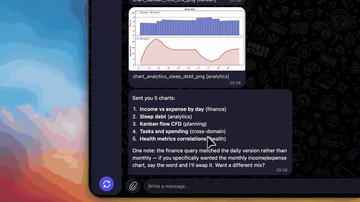

# obsidian-agent

**Telegram bot for Obsidian** — a self-hosted AI agent / life OS over your local vault (tasks, notes RAG, personal finance).

[](https://github.com/aeshef/obsidian-agent/actions/workflows/ci.yml)
[](LICENSE)
[](pyproject.toml)
[](https://obsidian.md)
[](https://core.telegram.org/bots)
[](docs/ENV_REFERENCE.md)
[](config/agent/)
[](https://github.com/aeshef/obsidian-agent/stargazers)

Open-source **Obsidian + Telegram** personal assistant: capture from chat (text, voice, photos), write into markdown / SQLite in the vault, answer with a tool-using LLM — not a chat that forgets.

> Vault-native, **fail-closed modules** (planning / knowledge / finance). If a capability is off, it is gone from UI, tools, prompts, and sync. **Core = Telegram + vault + LLM**; Mac, broker APIs, health pipes are optional [connectors](docs/CONNECTORS.md).

Edit in Obsidian whenever you want. Optional VPS for 24/7 capture. Vault sync = Obsidian Sync, Syncthing, or optional desktop scripts — [no Mac required](docs/connectors/HOSTING_WITHOUT_MAC.md).



## Who this is for

- You live in **Obsidian** and want a **Telegram** inbox that actually files into the vault
- You want a **self-hosted** personal AI assistant (not another cloud second-brain SaaS)
- You care about **PKM**, kanban tasks, and/or **personal finance** in one process
- You want modules you can turn off for real (capabilities manifest), including sync and tools

## Install (start here)

You do **not** need to learn this monorepo. Open the project in an AI coding chat and let it run setup.

### Cursor (easiest)

1. Clone and open **this repo root** in Cursor (the folder that contains `unified_bot/` and `scripts/` — not your Obsidian vault as the only root).
2. In chat type **`/setup`** (or `@setup` if slash commands are empty).
3. Answer a few questions: which **modules** (planning / finance / knowledge / full), language (`en` / `ru`), path to your vault. Connectors (broker, health, Mac, …) stay off unless you ask.
4. When it asks — paste tokens one at a time: [BotFather](https://t.me/BotFather) bot token, then an **OpenAI-compatible** LLM key ([DeepSeek](https://platform.deepseek.com/), OpenRouter, Groq, local vLLM, … — set `LLM_API_KEY` / `LLM_BASE_URL` / `LLM_MODEL`).
5. When it says the bot is ready: `./scripts/run_unified_bot.sh`, open Telegram, send `/start`.

The chat agent follows a fixed playbook (venvs, capabilities, vault folders, prompts). You only decide modules and paste secrets.

### Claude Code / Claude Desktop / similar

Same idea: open the **repo root**, then tell the agent:

> Run onboarding for this repo. Follow `.cursor/skills/setup/SKILL.md` end to end. Ask me one question at a time.

It will use the same checklist as Cursor `/setup`. If the tool cannot run `/setup`, that path is the fallback.

### Without an AI chat

```bash
git clone https://github.com/aeshef/obsidian-agent.git
cd obsidian-agent
./scripts/onboarding_wizard.sh --playbook planning   # or finance / knowledge / full
```

Then set secrets with `./scripts/oa-python.sh scripts/setup/env_tools.py set KEY 'value'` and start the bot (see [Quick start](#quick-start) below).

You need: Python **3.10–3.12**, an Obsidian vault path, Telegram token, LLM API key (any OpenAI-compatible host).

---

## The point

Most “AI + notes” stacks are a chat window glued to a folder. This repo is the opposite:

| Usual bot / Notion AI / Khoj / Mem | This |
|-----------|------|
| Answers live in the thread / cloud index | Answers are grounded in markdown / JSON / SQLite **in the vault** |
| One mega-prompt or opaque workspace AI | Three domains (`planning`, `knowledge`, `finance`) behind one process |
| Features you cannot turn off | **Capabilities manifest** — off means gone from UI, tools, prompts, and sync |
| Cloud is the database | Your Obsidian tree is canonical; a VPS is optional 24/7 capture |

### Why not X?

| Tool | Gap this fills |
|------|----------------|
| **Notion AI** | Vendor lock-in; your graph is not a local markdown vault you own |
| **Khoj / Mem / similar** | Great retrieval chat — weak as a **life OS** (kanban + ledger + fail-closed connectors) |
| **Plain Telegram bots** | No vault as system of record; history dies in the chat |

If a module is disabled, it does not leak into keyboards, LLM hints, or rsync. Fail-closed, not “hidden in a menu.”

### Retrieval eval (public)

Sanitized gold: [`eval/gold/public_v0.yaml`](eval/gold/public_v0.yaml) (21 synthetic queries, no personal vault). Run: see [`eval/gold/README.md`](eval/gold/README.md). Maintainer in-window Recall@1 / MRR ≈ **0.76** on private labeled runs (catalog window); publish a public baseline when you have a shareable vault fixture.

---

## What you can actually run

Everything below is real code in this repo. None of it requires a particular bank, city, employer, or person. Turn on only the slices you want.

### Capture from anywhere

- Text, **voice** (ASR), photos, PDFs, and links from Telegram
- Fast inbox while walking; structured files waiting in Obsidian later
- Money writes go through **confirm-in-chat** before they hit the ledger

### Planning that is a board, not a bot list

- Kanban as a real markdown board (columns, ids, logs)
- Goals, routines, weekly reflection
- Optional calendar overlay and “what moved this week” charts
- Monthly **archive of done** so the live board stays a working set

### Knowledge that compounds

- Ingest → tags → wikilinks → **RAG** over the corpus you already own
- Search like a teammate who read the vault, not like a web search
- Optional serendipity (a note you forgot, on a schedule you choose)
- Maintenance passes: hygiene, charts, audits — gated by capabilities

### Money as notes + a real ledger

- Natural-language expenses, income, transfers, debts, plans
- Dashboards rendered as Obsidian pages (not a separate SaaS)
- Optional connectors: broker API, manual investment accounts, workplace meal benefit, card feeds — **named in *your* config, never in this README**

### Cross-domain questions

The host can route a single sentence across tools, for example:

- what shipped vs what was spent in the same window
- a project on the board vs notes that mention it
- a category of spend vs the week’s calendar load

Cheap intents skip the heavy model; ambiguous or cross-domain ones escalate. Charts go out as Telegram media without mixing in random knowledge-base images.

### Split-brain hosting

```
You  →  Telegram  →  unified_bot (VPS or laptop, optional 24/7)
                         ↓
              vault markdown / JSON / SQLite
                         ↑
You  →  Obsidian.app  ←  Syncthing / Obsidian Sync / optional Mac rsync
```

Bots and long-running jobs can live on a server. The vault can live where you edit.
**No Mac required** — [HOSTING_WITHOUT_MAC](docs/connectors/HOSTING_WITHOUT_MAC.md).
Health metrics are **text snapshots** ([format](docs/connectors/health/FORMAT.md)), not Apple-only APIs.


---

## A day (nobody in particular)

Morning, one voice bubble: capture a task before it evaporates.  
On the move: a screenshot or a PDF becomes a tagged note, not a chat fossil.  
A line like “paid for lunch, card” waits for a tap, then lands in `finance.db` and the dashboard.  
Evening: “what actually got done, and what did that week cost?” — the agent reads the board, the ledger, and the notes.  
Obsidian still has every file. The thread was just the doorway.

No names. No amounts. No institutions. Your vault, your nouns.

---

## Quick start

Same steps as [Install](#install-start-here). Short form once you know the path:

**Cursor:** repo root → `/setup` → answer prompts → run bot.

**CLI:**

```bash
git clone https://github.com/aeshef/obsidian-agent.git
cd obsidian-agent
cp .env.example .env
./scripts/setup.sh
./scripts/onboarding_wizard.sh --playbook planning   # or finance / knowledge / full
./scripts/oa-python.sh scripts/init_vault_layout.py
./scripts/oa-python.sh scripts/onboarding_smoke.py --golden-planning
export PYTHONPATH=.
python -m unified_bot.main
```

**Docker** is runtime only after bootstrap (not a shortcut past `/setup`):

```bash
export HOST_VAULT_PATH="/absolute/path/to/your-vault"
docker compose up --build
```

Checklist contract: [`config/agent/bootstrap_checklist.yaml.example`](config/agent/bootstrap_checklist.yaml.example).  
Docs: [SETUP](docs/SETUP.md) · [ONBOARDING](docs/ONBOARDING.md) · [CONNECTORS](docs/CONNECTORS.md) · [HOSTING_WITHOUT_MAC](docs/connectors/HOSTING_WITHOUT_MAC.md) · [Health format](docs/connectors/health/FORMAT.md) · [SECURITY](SECURITY.md) · [CHANGELOG](CHANGELOG.md)

---

## Mix and match

| Module | In the vault |
|--------|----------------|
| **planning** | Kanban, goals, routines, reflection; optional calendar & device context |
| **knowledge** | Ingest, tags, links, search; optional serendipity & corpus maintenance |
| **finance** | Ledger, dashboards, debts, plans; optional broker / cards / benefits |

Connectors and sync steps: [docs/CONNECTORS.md](docs/CONNECTORS.md) · [docs/CAPABILITIES.md](docs/CAPABILITIES.md).  
Agent loop (route → tools → verify): [docs/AGENT_PLATFORM.md](docs/AGENT_PLATFORM.md).

Pin a domain on the reply keyboard, or leave **Auto**.

---

## Repository

```
obsidian-agent/
├── unified_bot/       # production Telegram host (composition root: host/)
├── shared/            # agent platform, LLM, capabilities, Telegram utils
├── planning_bot/
├── knowledge_bot/
├── finance_bot/
├── config/            # messages, vault_paths, UI — *.example → local
├── scripts/           # setup, deploy, obsidian_sync, onboarding
└── docs/
```

Copy lives in YAML. Python stays locale-agnostic. Default `AGENT_LOCALE=en`; Russian via `python3 scripts/setup/env_tools.py set-locale ru`.

---

## Documentation

| Doc | Topic |
|-----|--------|
| [SECURITY.md](SECURITY.md) | Tokens, vault, reporting |
| [CODE_OF_CONDUCT.md](CODE_OF_CONDUCT.md) | Contributor Covenant |
| [CHANGELOG.md](CHANGELOG.md) | Releases |
| [docs/SETUP.md](docs/SETUP.md) | Install, deploy, optional desktop sync |
| [docs/ONBOARDING.md](docs/ONBOARDING.md) | Modules, connectors, smoke |
| [docs/CONNECTORS.md](docs/CONNECTORS.md) | Core vs connectors contract |
| [docs/CAPABILITIES.md](docs/CAPABILITIES.md) | Manifest, sync gates, UI |
| [docs/PROMPTS_ONBOARDING.md](docs/PROMPTS_ONBOARDING.md) | Prompt tiers |
| [docs/LOCALE.md](docs/LOCALE.md) | EN / RU |
| [docs/ENV_REFERENCE.md](docs/ENV_REFERENCE.md) | Environment |
| [docs/TESTING.md](docs/TESTING.md) | pytest & CI |
| [CONTRIBUTING.md](CONTRIBUTING.md) | Contribute |

```bash
./scripts/run_tests.sh -q
```

Retrieval / harness: [eval/](eval/). CI: [.github/workflows/ci.yml](.github/workflows/ci.yml).

---

## License

MIT — [LICENSE](LICENSE).

---

## Русский

**obsidian-agent** — операционка вокруг Obsidian: Telegram как вход, vault как канон. Ядро = бот + vault + LLM. Задачи, знания, деньги и опциональные коннекторы включаются манифестом. Выключенное не торчит в меню, тулах и sync.

Не чат с амнезией, а цикл инструментов по **вашим** файлам. День из голоса, скрина и одной фразы про трату собирается в markdown и SQLite, которые вы потом открываете в Obsidian.

**Старт:** корень репозитория в Cursor → `/setup`. Либо `./scripts/onboarding_wizard.sh`. Язык UI по умолчанию английский: `python3 scripts/setup/env_tools.py set-locale ru`. Индекс: [docs/README.md](docs/README.md).
