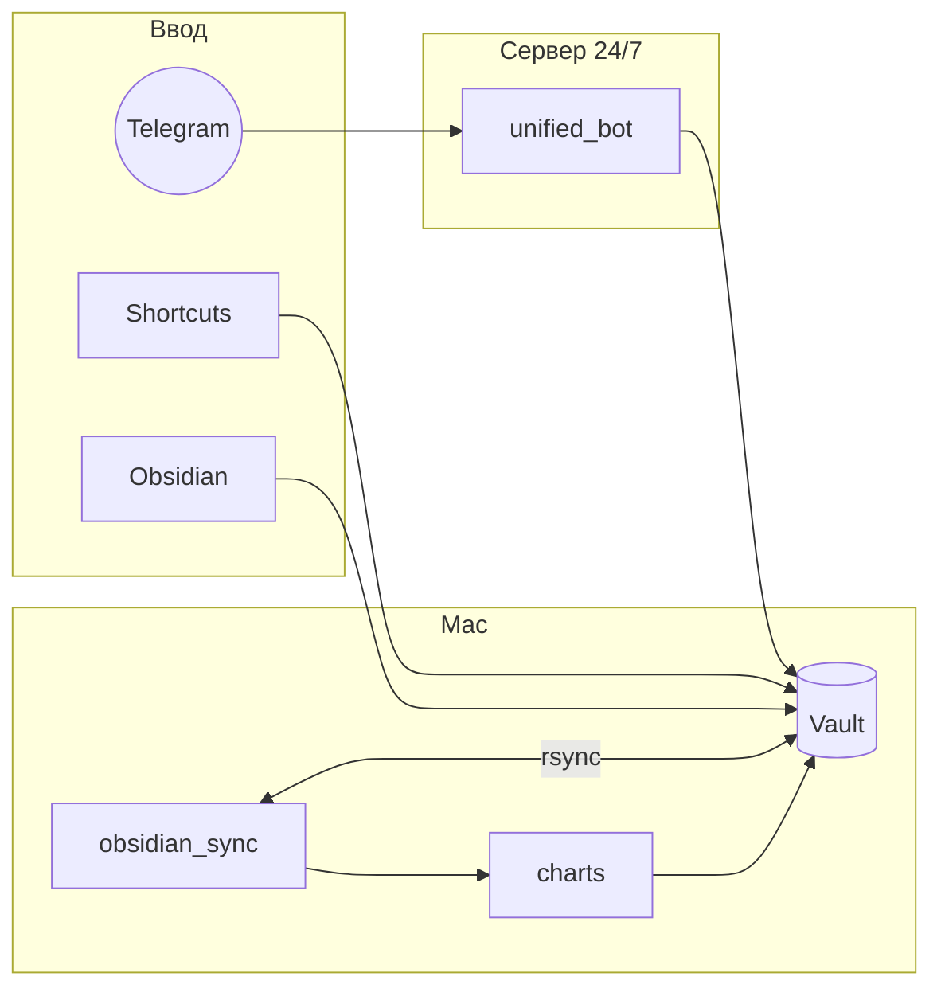

# obsidian-agent

> Telegram assistant that **writes into your Obsidian vault**: tasks, knowledge, and finance in one bot — modular connectors, optional Mac ↔ server sync.


**Install:** [docs/SETUP.md](docs/SETUP.md), [docs/ONBOARDING.md](docs/ONBOARDING.md), [docs/LOCALE.md](docs/LOCALE.md) (language toggle).

**Default UI language:** English (`AGENT_LOCALE=en`). Russian: `python3 scripts/setup/env_tools.py set-locale ru`.

---

## In one sentence

You message the bot (voice, text, media) — it updates **markdown, JSON, and SQLite** in your vault. Obsidian stays where you edit; the bot is fast capture and background logic.

---

## Three domains (mix and match)

| Domain | Capabilities |
|--------|----------------|
| **planning** | Kanban, goals, routines, reflection, calendar, device context |
| **knowledge** | Ingest notes from text/media/links, tags, search, RAG |
| **finance** | NLU expenses, dashboard, optional broker API and cards |

**Production:** `python -m unified_bot.main` — agent routing + classic Telegram handlers.

Modularity: [docs/CAPABILITIES.md](docs/CAPABILITIES.md). Guided setup: `.cursor/skills/obsidian-agent-onboarding`.

---

## Example phrases

| You say | System does |
|---------|-------------|
| Add task: finish slides by Friday | Kanban note in vault |
| Spent 12 on coffee, main card | NLU → `finance.db` |
| Save this link about Rust | Knowledge ingest + tags |
| How did I sleep yesterday? | Requires `apple_health` + snapshots |

---

## Docs

| Doc | Topic |
|-----|--------|
| [docs/SETUP.md](docs/SETUP.md) | First run, deploy, sync |
| [docs/ONBOARDING.md](docs/ONBOARDING.md) | Profiles and smoke tests |
| [docs/LOCALE.md](docs/LOCALE.md) | `AGENT_LOCALE`, EN/RU YAML |
| [docs/CAPABILITIES.md](docs/CAPABILITIES.md) | Modules, connectors, sync |
| [CONTRIBUTING.md](CONTRIBUTING.md) | PR guidelines |

MIT — [LICENSE](LICENSE).

---

# obsidian-agent (Русский)

> Личный ассистент в Telegram, который **пишет в ваш Obsidian vault**: задачи, знания и финансы — один бот, один конфиг, опционально sync Mac ↔ сервер.


**Установка и секреты** — в [docs/SETUP.md](docs/SETUP.md) и [docs/ONBOARDING.md](docs/ONBOARDING.md). Здесь — что умеет система и как она устроена как продукт.

---

## Одной фразой

Вы говорите в Telegram (или кидаете медиа) — бот раскладывает ответы по **markdown, JSON и SQLite** в vault. Obsidian остаётся местом, где всё **видно и редактируется**; бот — быстрый ввод и фоновая логика (kanban, поиск, NLU, графики).

---

## Зачем это существует

| Боль | Решение |
|------|---------|
| Мысль теряется, пока открываешь Obsidian | Telegram как UI: голос, текст, кнопки |
| Три «бота на жизнь» → три deploy и три venv | Монорепо + `unified_bot`: один процесс |
| Нужен 24/7, но vault удобнее на Mac | Rsync нужных папок; тяжёлые графики — локально |
| Не все нужны Health, брокер, корпоративный обед | **Модули и коннекторы**: выключено = нет в UI, tools и sync |

---

## Три домена (можно включить любой набор)

| Домен | Возможности | Где в vault |
|-------|-------------|-------------|
| **planning** | Kanban, цели, рутины, рефлексия, календарь, контекст устройств | папки задач, целей, рутин, дашбордов — имена в `config/vault_paths.yaml` |
| **knowledge** | Текст, голос, фото, PDF, ссылки → заметки, теги, поиск, RAG | настраиваемый каталог знаний |
| **finance** | Расходы NLU/голос, планы, дашборд, опционально брокер и карты | `finance.db` + графики в зоне дашбордов |

**Production:** [unified_bot](unified_bot/) — свободный текст через agent platform (домен → intent → tools); кнопки и FSM — у классических хендлеров.

Подробнее по коду доменов: [planning_bot/README.md](planning_bot/README.md), [knowledge_bot/README.md](knowledge_bot/README.md), [finance_bot/README.md](finance_bot/README.md). Платформа агента: [docs/AGENT_PLATFORM.md](docs/AGENT_PLATFORM.md).

---

## Модульность: только то, что вы подключили

Профиль задаётся в `config/agent/capabilities.yaml` (шаблон — `capabilities.yaml.example`, в git не хранится). **Обратная совместимость:** если файла нет, включены все модули и коннекторы (как после апгрейда старой установки).

| Слой | Что даёт |
|------|----------|
| **modules** | `finance` / `planning` / `knowledge` — целые области в Telegram |
| **connectors** | Опциональные пайплайны данных (см. таблицу ниже) |
| **features** | Тонкая настройка (ИИС брокера, график КБЖУ, cron-напоминания…) |
| **sync.profile** | Какие шаги `obsidian_sync.sh` гонять на Mac |

**Контракт:** если коннектор выключен, его **нет** в agent tools, подсказках LLM, кнопках (`ui_capabilities.yaml`) и шагах sync. Система не падает — просто ведёт себя как продукт без этой опции.

| Коннектор | Зачем | Если выключен |
|-----------|-------|----------------|
| `apple_health` | Снимки здоровья в vault, health-tools | Нет вопросов про шаги/сон в агенте; нет iPhone-sync шагов |
| `gmail_health_pipeline` | Почта → те же снимки (отдельно от Health) | Не нужен Gmail IMAP в `.env` |
| `apple_calendar` | Экспорт календаря → JSON + дашборд | Календарные tools и PNG не строятся |
| `mac_context` | Снапшоты фокуса с Mac | Нет mac-context tools |
| `broker_sync` | API портфеля (сегодня: `tinkoff` в `broker_sync.yaml`) | Нет кнопки «синк брокера» и API-sync |
| `manual_broker_accounts` | Ручные счета без API | Только если нужен обзор без API |
| `domestic_bank_cards` | Карты на финансовом дашборде | График без линий карт |
| `corporate_badge` | Корпоративный лимит на обеды (`badge.yaml`) | Нет бейджа в меню и `get_badge_status` |
| `knowledge_serendipity` | Случайная заметка дня в чат | Тихий knowledge без пушей |

Имена папок vault **не зашиты в Python** — только в `config/vault_paths.yaml.example` (можно назвать `Tasks/` вместо `100_…`).

Guided install: Cursor skill `.cursor/skills/obsidian-agent-onboarding` или [docs/ONBOARDING.md](docs/ONBOARDING.md). Справочник флагов: [docs/CAPABILITIES.md](docs/CAPABILITIES.md).

---

## Примеры (нейтральные)

Типичные фразы в чат — без привязки к конкретному человеку или работодателю:

| Вы пишете | Что происходит |
|-----------|----------------|
| «Добавь задачу: подготовить презентацию к пятнице» | Задача на kanban-доске в vault, лог в дашборде |
| «Что у меня в работе по проекту X?» | Agent: kanban + поиск по заголовкам/тегам |
| «Потратил 450 на обед, карта основная» | NLU → транзакция в `finance.db`, категория из конфига |
| «Сколько ушло на еду за месяц?» | Сводка + при включённом брокере — отдельно инвестиции |
| «Сохрани эту ссылку про Rust» | Knowledge ingest → заметка с тегами и wikilinks |
| «Найди заметки про отпуск» | RAG по vault, ответ с опорой на файлы |
| «Как спал вчера и сколько шагов?» | Только если включён `apple_health` и есть снимки в vault |
| «Свободен ли я во вторник после 15:00?» | Только с `apple_calendar` и актуальным экспортом |

Один бот в режиме **Auto** сам выбирает домен; можно закрепить **Finance** / **Planning** / **Knowledge** клавиатурой.

---

## Возможности по областям

### Planning

- **Kanban** в markdown: добавить, перенести, закрыть, поиск; action-логи для аналитики.
- **Цели** — год/квартал; опциональный текст «зачем я это делаю» (локальный файл, не в git).
- **Рутины** — чеклисты по дням, статус «сегодня», история.
- **Рефлексия** — обзор доски, целей, календаря, контекста устройств → markdown в vault.
- **Календарь** (коннектор) — экспорт с устройства → JSON + дашборд, PNG, опционально LLM по неделе.
- **Mac / iPhone контекст** (коннекторы) — снапшоты в `Данные/…`, агрегаты JSON, TTL и очистка мусора на sync.
- **Health** (коннектор) — ряды метрик, аномалии, корреляции, экспорт CSV; графики КБЖУ и веса — feature-флаги.

### Knowledge

- Пайплайн: текст, голос (ASR), фото, PDF, YouTube и ссылки.
- Автоимя, теги по онтологии, wikilinks, вложения.
- Поиск по vault, дописывание заметки из чата, опциональный serendipity.

### Finance

- NLU и голос → транзакции, категории, счета, планы, долги.
- Markdown-дашборд и PNG после sync.
- Брокер по API или ручные счета — отдельные коннекторы.

### Agent platform

- Один чат → роутинг **finance / planning / knowledge / host**.
- Tool loop с лимитами из `config/agent/platform.yaml`.
- Память сессии; опционально профиль и подтверждаемые инсайты (`/memory`).
- Промпты и строки — YAML (`domain_messages`, `messages.*`), в Python нет user-facing кириллицы в tools.

### Mac ↔ сервер (опционально)

- Периодический `obsidian_sync.sh`: pull/push только папок **включённых модулей**; шаги IMAP, графиков, maintenance — по `CAP_SYNC_*`.
- На сервере — unified bot 24/7; kanban monitor по cron, если включён planning.

---

## Как это работает




---

## Стартовые профили (идея, не инструкция)

| Профиль | Модули | Типичный пользователь |
|---------|--------|------------------------|
| Только задачи | `planning` | Kanban + цели, без финансов и KB |
| Только финансы | `finance` | Учёт расходов + дашборд |
| Только база знаний | `knowledge` | Inbox заметок из Telegram |
| Полный | все modules + нужные connectors | Power-user с Mac, VPS и несколькими источниками |

Команды и env — в [docs/ONBOARDING.md](docs/ONBOARDING.md), не дублируем здесь.

---

## Структура репозитория

```
obsidian-agent/
├── shared/           # LLM, agent, capabilities, telegram host
├── unified_bot/      # production entrypoint
├── finance_bot/  knowledge_bot/  planning_bot/
├── config/           # messages, vault_paths, agent platform (examples → local)
├── scripts/          # setup, deploy, obsidian_sync, capabilities CLI
├── docs/             # установка, onboarding, architecture
└── .env.example
```

---

## Конфигурация (куда смотреть)

| Что | Где |
|-----|-----|
| Секреты, `VAULT_PATH`, locale | `.env` |
| Модули и коннекторы | `config/agent/capabilities.yaml` (опц., из `.example` или omit = всё) |
| Имена папок vault | `config/vault_paths.yaml` (из `.example`) |
| Кнопки Telegram | `config/messages.ru.yaml` / `messages.en.yaml` (из `.example`) |
| Тексты tools и отчётов | `config/domain_messages.yaml` (из `.example`) |
| Промпты LLM | `config/agent/prompts/*.txt` (из `*.example.txt`) |
| Гейты кнопок | `config/ui_capabilities.yaml` (опц., из `.example`) |

Переменные окружения: [docs/ENV_REFERENCE.md](docs/ENV_REFERENCE.md).

---

## Документация

| Документ | Содержание |
|----------|------------|
| [docs/SETUP.md](docs/SETUP.md) | Первый запуск, venv, deploy, Mac sync |
| [docs/ONBOARDING.md](docs/ONBOARDING.md) | Модули, коннекторы, smoke, golden paths |
| [docs/CAPABILITIES.md](docs/CAPABILITIES.md) | Manifest, sync env, `@cap` в промптах |
| [docs/ARCHITECTURE.md](docs/ARCHITECTURE.md) | Монорепо, sync, CI |
| [docs/AGENT_PLATFORM.md](docs/AGENT_PLATFORM.md) | Routing, memory, tools |
| [docs/PROMPTS_ONBOARDING.md](docs/PROMPTS_ONBOARDING.md) | Уровни промптов и scaffolds |
| [docs/TESTING.md](docs/TESTING.md) | pytest и локальный прогон |
| [docs/REPO_LAYOUT.md](docs/REPO_LAYOUT.md) | Куда класть новый код |
| [docs/AGENT_CONFIG.md](docs/AGENT_CONFIG.md) | `config/agent/*.yaml` |
| [CONTRIBUTING.md](CONTRIBUTING.md) | PR и стиль |

---

## Legacy (не рекомендуется для новых установок)

| Режим | Запуск | В git |
|-------|--------|-------|
| **Production** | `python -m unified_bot.main` | да |
| Finance-only bot | `python -m bot.main` (cwd `finance_bot`) | да |
| Knowledge-only | `knowledge_bot/start_bot.py` | да (legacy) |
| Planning-only | `python -m planning_bot.app.main` | да (legacy) |
| Per-bot `deploy.sh` / `watchdog.sh` | отдельные venv на VPS | **нет** (author-only, `.gitignore`) |
| `scripts/watchdog.sh`, `restart_component.sh` | multi-bot era | **нет** |

Новый clone: один токен `TELEGRAM_UNIFIED_BOT_TOKEN`, `./scripts/deploy.sh --prod`, рестарт через `--restart-unified`.

---

## Качество и лицензия

CI: `py_compile`, smoke imports, pytest — см. `.github/workflows/ci.yml`.

```bash
./scripts/run_tests.sh
```

MIT — [LICENSE](LICENSE).
