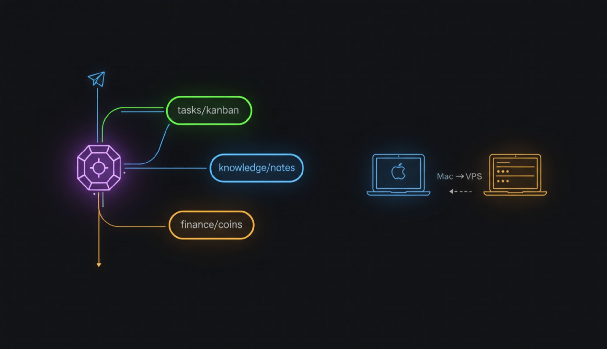
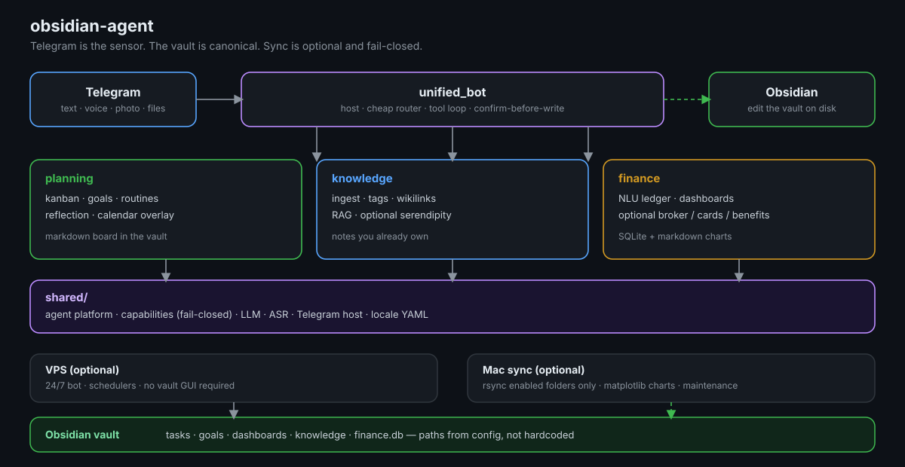

# obsidian-agent

[](https://github.com/aeshef/obsidian-agent/actions/workflows/ci.yml)
[](LICENSE)
[](pyproject.toml)
[](https://obsidian.md)
[](https://core.telegram.org/bots)
[](config/agent/)
[](https://github.com/aeshef/obsidian-agent/stargazers)

**A life OS that writes itself into an Obsidian vault.** Telegram is the sensor. The vault is the system of record. The agent is a tool loop over *your* files — not a chat that forgets.

> **One line:** vault-native agent with **fail-closed modules** — if a capability is off, it is gone from UI, tools, prompts, and sync.

Capture, file, recall, and chart: tasks, notes, money, calendar, and optional body/work connectors. Edit in Obsidian whenever you want. The bot never replaces the vault; it keeps it alive when you are not at the desk.



---

## The point

Most “AI + notes” stacks are a chat window glued to a folder. This repo is the opposite:

| Usual bot / Notion AI / Khoj / Mem | This |
|-----------|------|
| Answers live in the thread / cloud index | Answers are grounded in markdown / JSON / SQLite **in the vault** |
| One mega-prompt or opaque workspace AI | Three domains (`planning`, `knowledge`, `finance`) behind one process |
| Features you cannot turn off | **Capabilities manifest** — off means gone from UI, tools, prompts, and Mac sync |
| Cloud is the database | Your laptop’s Obsidian tree is canonical; a VPS is optional 24/7 capture |

### Why not X?

| Tool | Gap this fills |
|------|----------------|
| **Notion AI** | Vendor lock-in; your graph is not a local markdown vault you own |
| **Khoj / Mem / similar** | Great retrieval chat — weak as a **life OS** (kanban + ledger + fail-closed connectors + Mac sync) |
| **Plain Telegram bots** | No vault as system of record; history dies in the chat |

If a module is disabled, it does not leak into keyboards, LLM hints, or rsync. Fail-closed, not “hidden in a menu.”

### Retrieval eval (public)

Sanitized gold: [`eval/gold/public_v0.yaml`](eval/gold/public_v0.yaml) (21 synthetic queries, no personal vault). Run: see [`eval/gold/README.md`](eval/gold/README.md). Maintainer in-window Recall@1 / MRR ≈ **0.76** on private labeled runs (catalog window); publish a public baseline when you have a shareable vault fixture.

---

## What you can actually run

Everything below is real code in this repo. None of it requires a particular bank, city, employer, or person. Turn on only the slices you want.

### Capture from anywhere

- Text, **voice** (ASR), photos, PDFs, and links from Telegram
- Fast inbox while walking; structured files waiting in Obsidian later
- Money writes go through **confirm-in-chat** before they hit the ledger

### Planning that is a board, not a bot list

- Kanban as a real markdown board (columns, ids, logs)
- Goals, routines, weekly reflection
- Optional calendar overlay and “what moved this week” charts
- Monthly **archive of done** so the live board stays a working set

### Knowledge that compounds

- Ingest → tags → wikilinks → **RAG** over the corpus you already own
- Search like a teammate who read the vault, not like a web search
- Optional serendipity (a note you forgot, on a schedule you choose)
- Maintenance passes: hygiene, charts, audits — gated by capabilities

### Money as notes + a real ledger

- Natural-language expenses, income, transfers, debts, plans
- Dashboards rendered as Obsidian pages (not a separate SaaS)
- Optional connectors: broker API, manual investment accounts, workplace meal benefit, card feeds — **named in *your* config, never in this README**

### Cross-domain questions

The host can route a single sentence across tools, for example:

- what shipped vs what was spent in the same window
- a project on the board vs notes that mention it
- a category of spend vs the week’s calendar load

Cheap intents skip the heavy model; ambiguous or cross-domain ones escalate. Charts go out as Telegram media without mixing in random knowledge-base images.

### Split-brain hosting

```
You  →  Telegram  →  unified_bot (VPS, optional 24/7)
                         ↓
              vault markdown / JSON / SQLite
                         ↑
You  →  Obsidian.app  ←  Mac: rsync + matplotlib charts + maintenance
```

Bots and long-running jobs can live on a server. The vault and the graphs can live where you actually edit. Sync copies **only folders the manifest enabled**.



---

## A day (nobody in particular)

Morning, one voice bubble: capture a task before it evaporates.  
On the move: a screenshot or a PDF becomes a tagged note, not a chat fossil.  
A line like “paid for lunch, card” waits for a tap, then lands in `finance.db` and the dashboard.  
Evening: “what actually got done, and what did that week cost?” — the agent reads the board, the ledger, and the notes.  
Obsidian still has every file. The thread was just the doorway.

No names. No amounts. No institutions. Your vault, your nouns.

---

## Quick start

**One bootstrap contract** for every install path:  
[`config/agent/bootstrap_checklist.yaml.example`](config/agent/bootstrap_checklist.yaml.example)

**Requirements:** Python **3.10–3.12** (3.9 may work), an Obsidian vault path, a [Telegram bot token](https://t.me/BotFather), and an LLM key (DeepSeek by default).

### 1) Bootstrap (pick one UI — same checklist)

**Cursor (recommended):** open this repo root → `/setup` or `@setup` ([AGENTS.md](AGENTS.md)).

**CLI:**

```bash
git clone https://github.com/aeshef/obsidian-agent.git
cd obsidian-agent
cp .env.example .env
./scripts/setup.sh
./scripts/onboarding_wizard.sh --playbook planning   # or finance / full / knowledge_only
./scripts/oa-python.sh scripts/init_vault_layout.py
./scripts/oa-python.sh scripts/onboarding_smoke.py --golden-planning
```

### 2) Run the bot

```bash
export PYTHONPATH=.
python -m unified_bot.main
```

### Docker (runtime only — not a bootstrap shortcut)

Finish step 1 first (capabilities, vault paths, secrets). Then:

```bash
export HOST_VAULT_PATH="/absolute/path/to/your-vault"
docker compose up --build
```

Minimum `.env`: `TELEGRAM_UNIFIED_BOT_TOKEN`, `DEEPSEEK_API_KEY` (vault comes from the compose mount).

**Docs:** [SETUP](docs/SETUP.md) · [ONBOARDING](docs/ONBOARDING.md) · [SECURITY](SECURITY.md) · [CHANGELOG](CHANGELOG.md)

---

## Mix and match

| Module | In the vault |
|--------|----------------|
| **planning** | Kanban, goals, routines, reflection; optional calendar & device context |
| **knowledge** | Ingest, tags, links, search; optional serendipity & corpus maintenance |
| **finance** | Ledger, dashboards, debts, plans; optional broker / cards / benefits |

Connectors and sync steps: [docs/CAPABILITIES.md](docs/CAPABILITIES.md).  
Agent loop (route → tools → verify): [docs/AGENT_PLATFORM.md](docs/AGENT_PLATFORM.md).

Pin a domain on the reply keyboard, or leave **Auto**.

---

## Repository

```
obsidian-agent/
├── unified_bot/       # production Telegram host (composition root: host/)
├── shared/            # agent platform, LLM, capabilities, Telegram utils
├── planning_bot/
├── knowledge_bot/
├── finance_bot/
├── config/            # messages, vault_paths, UI — *.example → local
├── scripts/           # setup, deploy, obsidian_sync, onboarding
└── docs/
```

Copy lives in YAML. Python stays locale-agnostic. Default `AGENT_LOCALE=en`; Russian via `python3 scripts/setup/env_tools.py set-locale ru`.

---

## Documentation

| Doc | Topic |
|-----|--------|
| [SECURITY.md](SECURITY.md) | Tokens, vault, reporting |
| [CHANGELOG.md](CHANGELOG.md) | Releases |
| [docs/SETUP.md](docs/SETUP.md) | Install, deploy, Mac ↔ server sync |
| [docs/ONBOARDING.md](docs/ONBOARDING.md) | Modules, connectors, smoke |
| [docs/CAPABILITIES.md](docs/CAPABILITIES.md) | Manifest, sync gates, UI |
| [docs/PROMPTS_ONBOARDING.md](docs/PROMPTS_ONBOARDING.md) | Prompt tiers |
| [docs/LOCALE.md](docs/LOCALE.md) | EN / RU |
| [docs/ENV_REFERENCE.md](docs/ENV_REFERENCE.md) | Environment |
| [docs/TESTING.md](docs/TESTING.md) | pytest & CI |
| [CONTRIBUTING.md](CONTRIBUTING.md) | Contribute |

```bash
./scripts/run_tests.sh -q
```

Retrieval / harness: [eval/](eval/). CI: [.github/workflows/ci.yml](.github/workflows/ci.yml).

---

## License

MIT — [LICENSE](LICENSE).

---

## Русский

**obsidian-agent** — операционка вокруг Obsidian: Telegram как вход, vault как канон. Задачи, знания, деньги, календарь и опциональные коннекторы (здоровье, брокер, карты, контекст с машины) включаются манифестом. Выключенное не торчит в меню, тулах и rsync.

Не чат с амнезией, а цикл инструментов по **вашим** файлам. День из голоса, скрина и одной фразы про трату собирается в markdown и SQLite, которые вы потом открываете в Obsidian.

**Старт:** корень репозитория в Cursor → `/setup`. Либо `./scripts/onboarding_wizard.sh`. Язык UI по умолчанию английский: `python3 scripts/setup/env_tools.py set-locale ru`. Индекс: [docs/README.md](docs/README.md).
