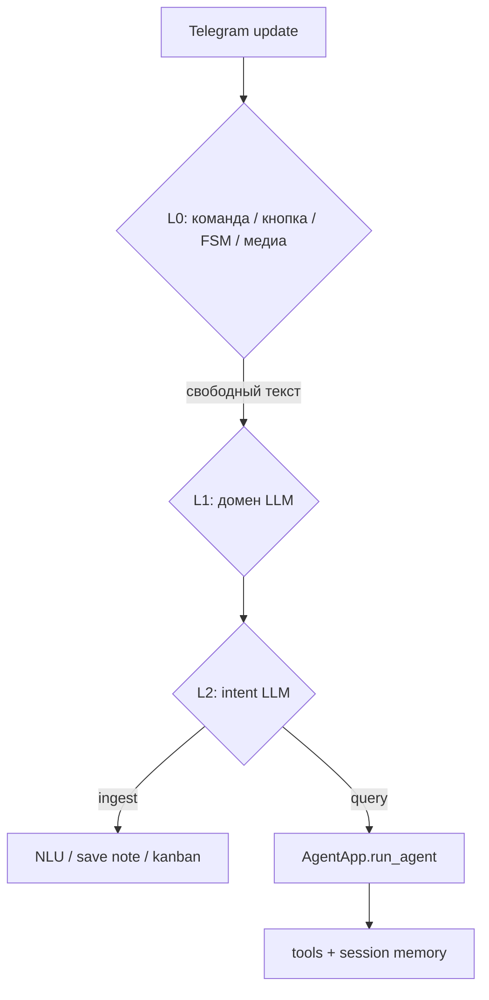

# Agent platform

## English

Free-text Telegram path: **routing → intent → tool loop → reply**. Code: `shared/agent/`, `shared/memory/`, `shared/telegram/host/`, `config/agent/`. Prod: `python -m unified_bot.main` with `DEPLOY_MODE=single`. Russian details and diagrams below.

---

## Русский (текущее состояние)

Единый слой для свободного текста в Telegram: **роутинг → intent → tool loop → ответ**.  
Код: `shared/agent/`, `shared/memory/`, `shared/telegram/host/`, `config/agent/`.

Prod: **`python -m unified_bot.main`**, `DEPLOY_MODE=single` — один процесс, три домена.

---

## Поток сообщения

- **L0** — без LLM; существующие хендлеры не трогаем.
- **L1/L2** — промпты в `config/agent/prompts/*.example.txt` (локально `*.txt`).
- **Query** — только через `run_agent` и `@tool` в `*/agent_tools.py`.

Инструменты: `*/agent_tools.py`, манифест `config/prompt_manifest.yaml.example`.  
Конфиги и промпты: [AGENT_CONFIG.md](AGENT_CONFIG.md).

---

## Ключевые модули

| Модуль | Роль |
|--------|------|
| `shared/agent/app.py` | `AgentApp`, адаптеры доменов, `build_system_prompt` |
| `shared/agent/core.py` | Tool loop, `execute_tool`, лимит итераций |
| `shared/agent/tools.py` | `@tool`, `ToolRegistry`, `select_tools` |
| `shared/agent/llm_classify.py` | Host / finance / planning intent |
| `shared/memory/session.py` | История диалога (SQLite) |
| `shared/memory/insights.py` | Подтверждаемые паттерны (`/memory`) |
| `shared/telegram/agent_delivery.py` | Ответ в чат + прогресс / стриминг |

---

## Память

1. **Session** — последние реплики user/assistant по `(chat_id, domain)`.
2. **Profile** — `config/agent/user_profile.md` (gitignore; шаблон `user_profile.md.example`).
3. **Insights** — после подтверждения в `/memory` (флаг `SYNTH_ENABLED`).

Доменные детали: `finance_bot/config/user_context.md`, `planning_bot/goals_context.md` — тоже gitignore.

---

## Деплой и режимы

| `DEPLOY_MODE` | Поведение |
|---------------|-----------|
| `single` (default) | Unified bot, L1 = LLM host router |
| `multi` | Legacy: три процесса, домен = env `AGENT_DOMAIN` |

См. [ENV_REFERENCE.md](ENV_REFERENCE.md), [SETUP.md](SETUP.md) (deploy), [CONTRIBUTING.md](../CONTRIBUTING.md).

---

## Связанные документы

- [ARCHITECTURE.md](ARCHITECTURE.md)
- [CONTRIBUTING.md](../CONTRIBUTING.md)
- [ONBOARDING.md](ONBOARDING.md) — примеры фраз и golden paths
- [../README.md](../README.md) — нейтральные примеры в чате (§ «Примеры»)
