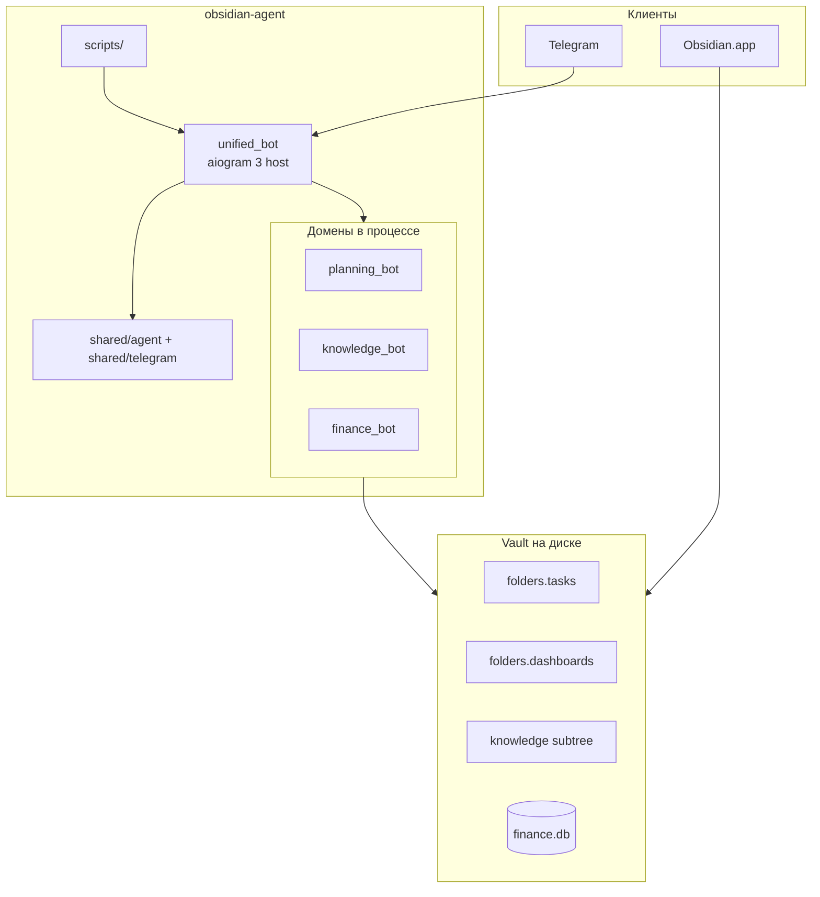
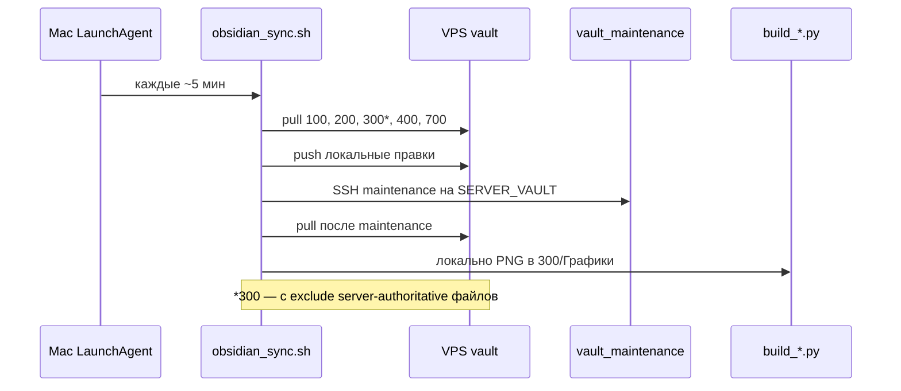

# Architecture / Архитектура

## English

Monorepo map: **unified_bot** hosts finance/planning/knowledge in one Telegram process; vault content lives under paths from `config/vault_paths.{en,ru}.yaml.example` (not hardcoded in Python). Mac runs `obsidian_sync.sh` (rsync + charts); VPS runs bots and maintenance. Shared code is infrastructure only (LLM, locale, yaml loaders). Prod entry: `python -m unified_bot.main`. Details below (Russian section mirrors the same structure).

---

## Русский

Краткая карта монорепо **obsidian-agent**: как связаны боты, vault, sync и общий код.

---

## Принципы

1. **Vault — источник правды для контента.** Боты читают и пишут markdown/JSON/SQLite в Obsidian; Telegram — только интерфейс. Имена папок и файлов — в `config/vault_paths.yaml` (см. `vault_paths.yaml.example`), не в `.py` и не в shell-хардкоде.
2. **Один конфиг.** Корневой `.env`; per-bot дубли не обязательны.
3. **Shared без бизнес-логики.** В `shared/` — инфраструктура (LLM, пути, логи, ASR, telegram utils), не доменные сервисы ботов.
4. **Разделение Mac / VPS.** Боты и тяжёлый maintenance — на VPS; rsync и matplotlib-графики — на Mac.

---

## Компоненты



| Слой | Роль |
|------|------|
| `unified_bot/` | Единая точка входа prod: `shared/telegram/host/bootstrap.py`, `DEPLOY_MODE=single` |
| `shared/agent/` | AgentApp, tool loop, LLM routing, session memory |
| `shared/telegram/` | Host dispatch, voice, `deliver_agent_answer`, progress UI |
| `scripts/` | Deploy (`--prod` рестартит только unified), obsidian_sync, CI |
| `planning_bot/` | Kanban, goals, routines, reflection, calendar → vault |
| `knowledge_bot/` | Extract pipeline, tags, query/save → `700_База_Данных` |
| `finance_bot/` | NLU transactions, scheduler, dashboard builder |

---

## Точки входа и runtime

**Prod (рекомендуется):** один процесс

```bash
python -m unified_bot.main   # DEPLOY_MODE=single, TELEGRAM_UNIFIED_BOT_TOKEN
```

Finance/planning/knowledge schedulers и handlers регистрируются внутри host bootstrap.

**Legacy (три polling-процесса):** `DEPLOY_MODE=multi`, отдельные `run.sh` + watchdog. `./scripts/deploy.sh --prod` по умолчанию **не** рестартует legacy; флаг `--legacy-bots`.

| Режим | Запуск |
|-------|--------|
| unified | `python -m unified_bot.main` |
| finance legacy | `python -m bot.main` |
| knowledge legacy | `start_bot.py` |
| planning legacy | `python -m planning_bot.app.main` |

Все `run.sh` вызывают `bootstrap_python`:

```
PYTHONPATH = $bot_root:$monorepo_root
```

Импорты: `from shared.llm import LLMClient`, локальные пакеты бота без установки как pip-пакета.

---

## Поток obsidian_sync

Оркестратор: `scripts/obsidian_sync.sh` (обёртка в корне — symlink).



**Kanban monitor** не дублируется в sync: на VPS cron `planning_bot/scripts/cron_kanban_monitor.sh` (установка: `scripts/install_planning_crontab.sh`).

---

## LLM и внешние API

| Назначение | Типичный провайдер | Переменные |
|------------|-------------------|------------|
| planning, finance NLU | DeepSeek | `DEEPSEEK_API_KEY`, `DEEPSEEK_MODEL` |
| knowledge (часть пайплайна) | OpenRouter | `OPENROUTER_API_KEY` |
| ASR (голос) | OpenAI-compatible / Ollama | `ASR_*`, `OPENAI_*` |
| finance broker | Tinkoff Invest API | `TINKOFF_API_TOKEN` |

`finance_bot/bot/llm.py` — тонкая async-обёртка над `shared.llm.LLMClient`.

---

## Тесты и CI

| Область | Где |
|---------|-----|
| Локально | `bash scripts/run_tests.sh` (finance venv + knowledge venv) |
| Smoke imports | `scripts/smoke_imports.sh` |
| Agent/platform/calendar/progress | `tests/test_agent_*.py`, `test_calendar_sync.py`, … |
| Knowledge ingest | `tests/test_note_complete.py` (knowledge venv) |
| Workflow | `.github/workflows/ci.yml` — `run_tests.sh` + job **capabilities** (onboarding smoke, `test_messages_locale_parity`, prompt guards) |

---

## Что намеренно не в shared

- Kanban/goals/routines (planning)
- Extract/render/routing (knowledge)
- Transaction DB models, NLU menus (finance)

Это остаётся в ботах; при дублировании выносим только инфраструктурные куски.

---

## Связанные документы

- [SETUP.md](SETUP.md) — установка, Mac↔VPS sync (§10)
- [ENV_REFERENCE.md](ENV_REFERENCE.md) — переменные окружения
- [ONBOARDING.md](ONBOARDING.md) — модули и коннекторы
